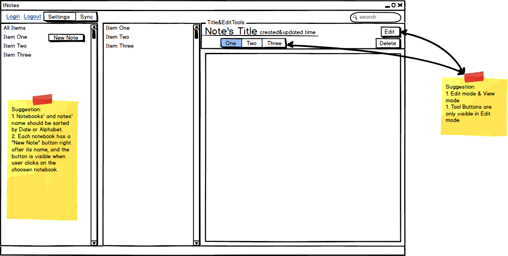
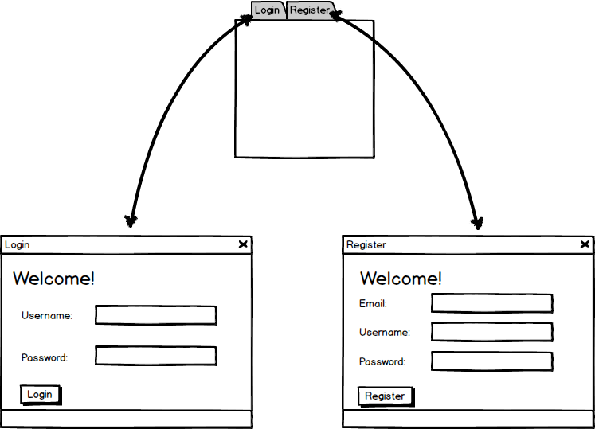

tNotes客户端
=====

成员
-----
* 胡宽敏
* 林标标
* 林炎厚
* 郑小维

说明
-----

1. markdown2html.dll

  基于cpp-markdown编写的动态库，作用为将markdown语法翻译为html，可以使用testdll进行测试，
  编译后直接运行。效率可能有些低。

2. Qt下json配置
   只需要将json文件下所有文件导入项目工程即可。
   调用客户端后台函数只需包含#include "Operation.h"即可，详细函数说明请看"Operation.h"中函数说明。

3 测试数据使用
  将测试数据文件夹下的文件拷到工程目录下即可使用，注意不要建文件夹，因为我用的是相对路径
=======
图片
-----

1. 主界面设计图

2. 登陆界面设计图

